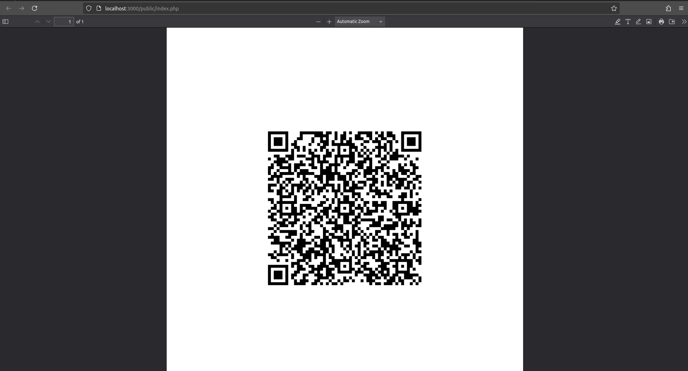

# QR Ticket System

## Overview
The QR Ticket System is a lightweight PHP application designed to generate event tickets with embedded QR codes. The QR codes encode key details such as user information, event name, date, and payment verification data. 

Tickets are generated in PDF format and are available for download, ensuring a professional and secure delivery method.

## Features
- **QR Code Generation**: Encodes ticket data for secure scanning and verification.
- **PDF Ticket Creation**: Generates professionally designed, branded tickets.
- **Database Integration**: Fetches user and event details from an existing database.
- **Ticket Verification**: QR codes are scannable for real-time validation.

## File Structure
```plaintext
qr_ticket_system/
├── database
│   ├── test_db.sql        # Example database schema
├── public
│   ├── index.php          # Main entry point for ticket generation
├── screenshot             # Directory for application screenshots
├── src
│   ├── Config
│   │   ├── Database.php   # Database connection class
│   ├── PDF
│   │   ├── PDFGenerator.php  # Handles PDF generation
│   ├── QR
│   │   ├── QRGenerator.php   # Handles QR code creation
│   ├── Ticket
│   │   ├── TicketGenerator.php # Combines QR and PDF logic
├── vendor                 # Composer dependencies
│   ├── autoload.php
├── .gitignore             # Git ignored files
├── composer.json          # Composer configuration
├── composer.lock          # Composer lock file
├── favicon.ico            # Application favicon
```

## Prerequisites
- PHP 7.4+
- Composer
- A web server (e.g., Apache, Nginx, or PHP's built-in server)
- MySQL for the database

## Installation
1. Clone the repository:
   ```bash
   https://github.com/your-username/qr-ticket-system.git
   cd qr_ticket_system
   ```
2. Install dependencies:
   ```bash
   composer install
   ```
3. Set up the database:
   - Import the `test_db.sql` file located in the `database/` directory.
   - Update database credentials in `src/Config/Database.php`.

4. Start the application:
   - For development:
     ```bash
     php -S localhost:8000 -t public
     ```

## Usage
1. Access the application via your browser:
   ```
http://localhost:8000
   ```
2. Generate a ticket by providing required event and user details.
3. Download the generated ticket in PDF format.
4. Verify the ticket by scanning the QR code.

## Example Screenshots


## License
This project is licensed under the MIT License. See the LICENSE file for details.
